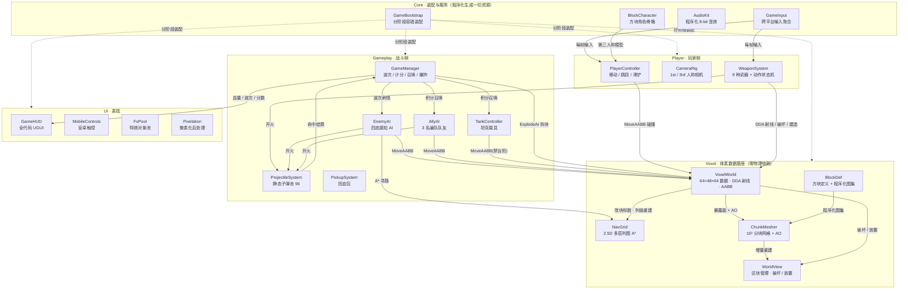

# 方块竞技场 Pixel Arena — Unity 体素射击 Demo

一个 **像素射击（Pixel Strike 3D）× 我的世界** 风格的射击游戏 Demo，支持 **PC（Windows）** 与 **Android** 双端。  
工程**不含任何美术资源文件**：贴图、模型、音效、UI 全部由代码在运行时程序化生成，打开即可运行。

- Unity 版本：**2022.3 LTS**（内置渲染管线，无需 URP/HDRP）
- 视角：**第一人称 / 第三人称可切换**
- 地图：**64 × 48 × 64 固定方块竞技场**（中央高台、四角塔楼、掩体、树木、围墙）
- 玩法：波次刷怪 + 三把武器 + 方块破坏/建造

---

## 一、怎么跑起来

1. 安装 **Unity Hub** → 安装 **Unity 2022.3 LTS**（同时勾选 *Android Build Support (SDK / NDK / JDK)* 若要出安卓包）。
2. Unity Hub → `Open` → `Add project from disk` → 选择本文件夹。
3. 首次打开会编译脚本（1～2 分钟）。编译完成后，编辑器脚本会**自动创建并打开** `Assets/Scenes/Main.unity`（场景里只有一个挂了 `GameBootstrap` 的物体）。
4. 点 **Play** 开始游戏。

> 若场景没有自动创建：菜单 **方块竞技场 → 1. 创建或修复主场景**。

### 打包

| 目标          | 操作                                                                       |
| ----------- | ------------------------------------------------------------------------ |
| Windows x64 | 菜单 **方块竞技场 → 3. 构建 Windows x64**                                         |
| Android APK | 菜单 **方块竞技场 → 4. 构建 Android (APK)**（自动配置 IL2CPP + ARM64 + 横屏 + MinSDK 23） |

> `Assets/Editor/AutoBuildPlayer.cs` 会在打开工程时自动检查：exe / apk 不存在或源码更新时，先打 PC 再打 APK，全部完成后自动退出编辑器（未装 Android Build Support 模块时跳过 APK 并在 Console 说明）。也可以直接用 `File → Build Settings`，场景已在列表里。APK 产物在 `Build/Android/PixelArena.apk`。

---

## 二、操作

### PC

| 按键         | 功能                |
| ---------- | ----------------- |
| `W A S D`  | 移动                |
| 鼠标         | 转视角               |
| 鼠标左键       | 射击（打中敌人 / 打碎方块）   |
| 鼠标右键       | 放置方块（木箱掩体，6 格内）   |
| `Space`    | 跳跃                |
| `Shift`    | 冲刺                |
| `Ctrl / C` | 蹲下                |
| `R`        | 换弹                |
| `Q` / 滚轮   | 切换武器（有收枪 / 出枪动作）  |
| `V`        | 切换第一 / 第三人称       |
| `F`        | 检视武器（CS2 式转枪查看动作） |
| `G`        | 打开 / 关闭小队召唤面板（小队模式） |
| `E`        | 上 / 下坦克（走到车边）     |
| `Esc`      | 暂停                |

### Android

| 触控       | 功能                |
| -------- | ----------------- |
| 左半屏拖动    | 浮动虚拟摇杆（推到边缘 = 冲刺） |
| 右半屏拖动    | 转视角（带轻微辅助瞄准）      |
| `FIRE`   | 按住持续射击            |
| `JUMP`   | 跳跃                |
| `RELOAD` | 换弹                |
| `GUN`    | 切换武器              |
| `VIEW`   | 切换第一 / 第三人称       |
| `BUILD`  | 放置方块              |
| `LOOK`   | 检视武器              |
| `SQUAD`  | 打开 / 关闭小队召唤面板（小队模式，面板里有可点的关闭按钮） |
| `RIDE`   | 上 / 下坦克（走到车边按）  |
| `SLIDE`  | 滑铲（摇杆推满冲刺中点按） |
| 右上角 `II` | 暂停                |

### 游戏内设置（主菜单 / 暂停 → 设置）

| 分类 | 项目    | 说明                                  |
| -- | ----- | ----------------------------------- |
| 画面 | 分辨率   | 自动读取本机全部可用分辨率（含刷新率），也可选「跟随系统」       |
| 画面 | 显示模式  | 窗口 / 无边框 / 独占全屏                     |
| 画面 | 帧率上限  | 不限 / 30 / 60 / 90 / 120 / 144 / 240 |
| 画面 | 像素化画面 | 开关低分辨率放大后处理（关掉更清晰、更吃性能）             |
| 画面 | 像素倍率  | 1～6，越大越糊但越流畅                        |
| 画面 | 显示帧率  | 右上角实时 FPS                           |
| 操作 | 视角灵敏度 | 0.3 ～ 8.0                           |
| 操作 | 反转纵向  | 反转 Y 轴                              |
| 操作 | 自动开火  | 仅安卓端                                |
| 音频 | 音效音量  | 0% ～ 100%                           |

设置保存在 `PlayerPrefs`，下次启动自动生效；面板底部有「恢复默认」。

> 暂停界面是独立面板（半透明压暗背景 + 卡片），会显示本局得分 / 击杀 / 波次 / 剩余敌人，与主菜单完全不同。

---

## 三、玩法

- **波次战斗**：每一波敌人数量递增（最多 16 个），清空后进入下一波。敌人有步兵 / 突击兵 / 重装兵三种。
- **小地图**：右上角俯视图，实时显示所有敌人（红点）和你的位置与朝向（蓝色箭头）；地形按方块颜色和高度着色，开局生成一次。
- **找最后的敌人**：每波只剩 5 名以内敌人时，小地图红点开始闪烁，屏幕边缘出现红色方向箭头指向看不见的敌人，HUD 顶部常驻「还剩 N 名敌人」。
- **刷怪位置**：敌人只在玩家周围 15～30 格的环形区域里、地面平整且头顶两格净空的位置出生，并优先选看得见玩家的地点；出生即朝玩家方向行动，长时间失去目标后会主动搜索过来。
- **敌人不会飞檐走壁**：跳跃高度被限制为刚好一格，且体素移动的「自动上台阶」只在站稳地面时生效，因此敌人无法靠「跳一下 + 空中台阶抬升」无限爬上高台；遇到两格以上的墙只能绕行。
- **武器**：三把枪各有独立建模——步枪（红点 + 提把 + 弧形弹匣，全自动）、霰弹枪（双管 + 木质泵动 + 管式弹仓，9 颗弹丸）、狙击枪（长枪管 + 瞄准镜 + 两脚架，高伤害可一枪打穿石头）。打头 2.2 倍伤害。
- **武器动作**：换弹（枪身下沉、弹匣抽出再插回，两段音效）、切枪（收枪下沉 → 出枪抬起）、`F` 检视（枪身翻转让玩家端详）。动作进行中不能开火，开火会立即打断检视。
- **可破坏地形**：每种方块有硬度，石头 3 枪、金属 6 枪、木箱 1 枪；打碎后掉落方块碎片。
- **可建造**：随时搭木箱当掩体。
- **击杀补给**：每击杀一个敌人，三把武器都会补充弹药。

---

## 四、工程结构

```
Assets/
  Scenes/Main.unity              (首次打开时由编辑器脚本自动创建)
  Scripts/
    Core/
      GameBootstrap.cs           总装配：创建世界/相机/玩家/UI/管理器
      GameManager.cs             状态机、波次、计分、重生
      GameInput.cs               跨平台输入聚合 + 玩家设置
      AudioKit.cs                程序化生成 8-bit 音效 + 播放池
      BlockCharacter.cs          方块拼装的角色（主角英雄模型 / NPC 三种兵种变体）
    Voxel/
      BlockDef.cs                方块属性 + 程序化像素贴图图集
      VoxelWorld.cs              体素数据、竞技场生成、DDA 射线、AABB 碰撞
      ChunkMesher.cs             区块网格生成（暴露面 + 面亮度 + AO）
      WorldView.cs               区块管理、破坏/放置、瞄准高亮
    Player/
      PlayerController.cs        移动、跳跃、冲刺、蹲下（体素 AABB 碰撞）
      CameraRig.cs               第一/第三人称、后坐力、震动、头部摆动
      WeaponSystem.cs            射击、换弹/切枪/检视动作、破坏/放置方块
      WeaponModels.cs            五把枪的方块建模（视图模型 + 世界模型）
    Gameplay/
      EnemyAI.cs                 敌人 AI + 投射物系统
    VFX/FxPool.cs                碎石、曳光弹、枪口火光对象池
    UI/GameHUD.cs                HUD、主菜单、暂停、死亡、设置
    UI/MobileControls.cs         安卓虚拟摇杆与按钮
    Util/Pixelation.cs           低分辨率渲染放大（像素风 + 提帧）
    Util/VoxelAssets.cs          共享材质与几何工具
  Editor/DemoSetup.cs            自动建场景 / 安卓配置 / 一键构建
  Editor/AutoBuildPlayer.cs      打开工程即自动重新打包（临时工具，可删）
Resources/
  Shaders/VoxelBlocks.shader     方块图集着色器（不依赖 Unity 灯光）
  Shaders/VoxelSolid.shader      纯色体着色器（角色 / 道具）
  Shaders/VoxelUnlit.shader      无光照透明着色器（特效 / 高亮框）

```

### 架构与数据流

五层结构自上而下：**Core 负责装配与服务，Player / Gameplay 是玩法两侧，Voxel 是零物理依赖的体素数据基座，UI 只做表现**。所有资源（贴图 / 模型 / 音效 / UI）由代码在运行时程序化生成，工程不含美术文件。



**一图读懂三条主干数据流**：

1. **输入 → 玩法 → 数据**：`GameInput` 每帧聚合键鼠 / 触控输入 → 玩家与 AI 单位全部通过手写 `MoveAABB` / DDA 射线与 `VoxelWorld` 体素数据交互（不使用 Rigidbody / Collider）；
2. **战斗闭环**：任意阵营开火 → 子弹进入 `ProjectileSystem` 静态池 → 命中结算回 `GameManager` → `ExplodeAt` 直接改写体素数据 → 受影响区块由 `ChunkMesher` 增量重建、`NavGrid` 列级重建——**伤害、拆地形、寻路图更新走的是同一条数据通路**；
3. **数据 → 表现**：`VoxelWorld` 只在方块变化时通知渲染层重建，`GameHUD` 仅在数值变化时刷新文本，全链路无每帧全量刷新。

---

## 五、技术要点

1. **体素区块网格**：16³ 分块，只生成暴露面，AO 与环境光遮蔽烘焙进顶点色，单块 1 个 draw call；修改方块时只重建受影响区块（每帧最多 3 个）。
2. **零物理依赖**：玩家、敌人、子弹全部用体素 AABB + DDA 射线步进解算，不用 Rigidbody / Collider，移动端开销极低。
3. **自给自足的着色器**：`PixelArena/VoxelBlocks` 用材质参数做方向光与雾，不依赖场景灯光与全局光照。
4. **程序化资源**：16×16 像素图集（噪声/砖纹/木纹/铆钉等）由代码画进 `Texture2D`；音效由波形函数写进 `AudioClip`。
5. **像素化后处理**：先渲染到 1/2~1/3 分辨率 RT 再用 Point 采样放大，既出像素颗粒感又显著提升安卓帧率（可在设置里关闭）。
6. **跨平台输入**：`GameInput` 统一接口，PC 走键鼠（`Cursor.lock` 未锁定，可在设置里自行加锁定），移动端走原生 `Input.touches`，互不干扰。

---

## 六、可以继续做的事

- 加 `Cursor.lockState = CursorLockMode.Locked` 让 PC 鼠标锁定（当前为方便编辑器调试未锁定）。
- 把 `VoxelWorld` 的分块 + 存档扩展成真正的无限地形（生存模式）。
- 加入多人联机（Mirror / Netcode）、更多武器与配件；小地图可进一步做成带缩放 / 全屏大地图 / 任务点标记。
- 把方块放置类型做成可切换（目前固定木箱，改 `WeaponSystem.BuildBlock` 即可）。

---

## 七、常见问题

**Q：打开后是空场景 / 没有反应？**  
A：Console 看是否有编译错误；然后菜单 **方块竞技场 → 1. 创建或修复主场景**，再点 Play。

**Q：鼠标转视角太快 / 太慢？**  
A：设置 → 操作 → 视角灵敏度（0.3 ～ 8.0，默认 2.2）。开始游戏时鼠标会自动锁定，按 Esc 解锁并暂停。

**Q：画面是洋红色 / 打包后进游戏只有天空、什么都没有？**  
A：自定义着色器没被打进包。**着色器必须放在 `Assets/Resources/Shaders/` 下**（Resources 目录的资源必定进包），  
代码里通过 `VoxelAssets.ResolveShader()` 用 `Resources.Load` 读取，`Shader.Find` 只作为编辑器内的兜底。  
同时这三个着色器也写进了 `ProjectSettings/GraphicsSettings.asset` 的 Always Included Shaders。  
若仍异常，看 `%USERPROFILE%\AppData\LocalLow\PixelArena\方块竞技场 Pixel Arena\Player.log` 的堆栈。

**Q：安卓构建失败？**  
A：Unity Hub 里给 2022.3 添加 **Android Build Support** 模块；菜单 **方块竞技场 → 2. 应用安卓构建设置** 后再构建。

**Q：中文显示为方块？**  
A：UI 字体走系统字体回退列表（Windows 微软雅黑 / Android Noto CJK）。若设备缺中文字体，HUD 的英文部分仍会正常显示。
